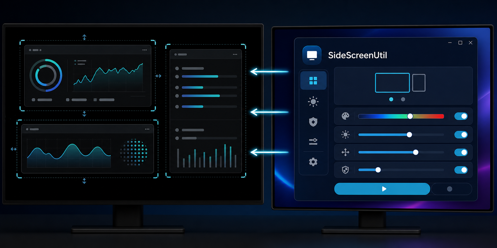

# SideScreenUtil

SideScreenUtil turns a selected Windows display into a black-background, multi-window monitoring canvas. It is designed for making practical use of an OLED secondary display while reducing static, uneven pixel wear.

> No application can guarantee that an OLED panel will never develop burn-in. Keep the physical display brightness reasonable, use the panel's built-in pixel-shift and pixel-refresh features, and avoid leaving unchanged content visible for long periods.

## Feature overview



Select and configure windows on the primary display, then monitor them in a flexible layout on a black secondary-screen canvas. SideScreenUtil can move the rendered content gradually and apply visual filters to reduce long-running, spatially uneven pixel use.

## Highlights

- Monitor any number of application windows at the same time.
- Add, remove, or switch source windows without restarting monitoring mode.
- Capture each window with Windows Graphics Capture, with an automatic `PrintWindow` fallback.
- Preserve the source windows' relative positions, or use grid, horizontal, vertical, and manual layouts.
- Press `Ctrl+Alt+L` to edit the layout directly on the secondary display. Pointer-triggered hiding is temporarily suspended while editing.
- Use original-color, grayscale, fixed monochrome, cycling monochrome, contour, or cycling-contour filters.
- Adjust contour sensitivity and width for more legible small text.
- Reduce brightness, drift the canvas, vary its size slightly, and schedule fully black rest periods.
- Switch live between a memory-saving one-megapixel-per-window capture limit and full source-window resolution.
- Hide the monitoring canvas as soon as the pointer enters the selected display, and restore it when the pointer leaves.
- Load the interface language from extensible JSON language packs.

## Requirements

- 64-bit Windows 10 version 1903 or newer, or Windows 11
- Python 3.10 or newer when running the full edition from source

## Choose an edition

Every GitHub Release contains two maintained Windows editions. They implement the same core
multi-window monitoring and OLED-protection workflow and are updated in parallel.

| Download | Edition | Best for |
| --- | --- | --- |
| `SideScreenUtil.exe` | Full compatibility (Python/Qt) | The established implementation and widest compatibility |
| `SideScreenUtil-native.exe` | Compact native (Rust/Win32) | A sub-megabyte download and much lower idle memory use |

The editions store their settings separately, so they can be installed and tested side by side.
See [NATIVE_PREVIEW.md](NATIVE_PREVIEW.md) for native build details.

## Run from source

```powershell
.\scripts\setup.ps1
.\scripts\run.ps1
```

If Python is not available on `PATH`:

```powershell
.\scripts\setup.ps1 -PythonExe "C:\Path\To\python.exe"
```

## Basic operation

1. Select the OLED or other target display.
2. Select one or more source windows.
3. Choose an initial layout and visual filter.
4. Click **Start secondary-screen mode**.
5. Press `Ctrl+Alt+L` to move and resize monitored windows directly on the target display; press it again to save.
6. Move the pointer onto the target display whenever you need to interact with the normal desktop.

The **Protection** tab contains the capture-resolution switch:

- **Memory saver** limits each cached source frame to roughly one megapixel.
- **Full resolution** retains every source pixel and uses more memory.

The switch takes effect on the next captured frame and does not require restarting monitoring mode.

## Languages

The included languages are Simplified Chinese and English. Select a language in the top-right corner of the control panel and restart SideScreenUtil to apply it throughout the interface.

Language packs are JSON files stored in [`assets/i18n`](assets/i18n). The build automatically discovers and bundles every `*.json` file in that directory. See [DEVELOPMENT.md](DEVELOPMENT.md#adding-a-language) for the schema and contribution steps.

## Build the executables

```powershell
.\scripts\build.ps1
.\scripts\build-native.ps1
```

The release executables are written to `dist\SideScreenUtil.exe` and
`dist\SideScreenUtil-native.exe`.

Prebuilt Windows executables are available from the project's
[GitHub Releases](https://github.com/DennyClarkson/SideScreenUtil/releases). Each release contains
both editions and a separate SHA-256 checksum for each executable.

Smoke tests for the packaged application:

```powershell
.\dist\SideScreenUtil.exe --smoke-test
.\dist\SideScreenUtil.exe --capture-smoke-test
.\dist\SideScreenUtil-native.exe --smoke-test
.\dist\SideScreenUtil-native.exe --capture-smoke-test
.\dist\SideScreenUtil-native.exe --ui-smoke-test
```

## Development checks

```powershell
.\.venv\Scripts\python.exe -m pytest
.\.venv\Scripts\python.exe -m ruff check .
```

More architecture, localization, testing, and release information is available in [DEVELOPMENT.md](DEVELOPMENT.md).

## OLED design rationale

Differential OLED aging is associated with long-running, spatially uneven pixel use. SideScreenUtil therefore prioritizes lower output brightness, a smaller lit area, movement of fixed boundaries, and fully black rest periods. Hue cycling distributes color-channel use but does not eliminate differences in subpixel lifetime.

Background reading:

- [Lifetime modeling for organic light-emitting diodes: a review and analysis](https://link.springer.com/article/10.1080/15980316.2022.2126018)
- [Impact of long-term stress on the light output of a WRGB AMOLED display](https://researchportal.hkust.edu.hk/en/publications/impact-of-long-term-stress-on-the-light-output-of-a-wrgb-amoled-d/)
- [OpenCV Canny edge detector principles](https://docs.opencv.org/4.10.0/da/d5c/tutorial_canny_detector.html)

The contour implementation uses a lightweight, one-sided NumPy luminance gradient. Adjustable contour width expands only toward equally bright or brighter pixels, keeping strokes inside bright objects and text instead of bleeding into the black background. OpenCV is not included in the final executable.

## Known limitations

- DRM-protected video cannot normally be captured.
- Windows running with higher privileges than SideScreenUtil may require SideScreenUtil to run at the same privilege level.
- A minimized application may stop submitting new frames. Ordinary window occlusion generally does not stop Windows Graphics Capture.
- Full-resolution capture can use considerably more memory when several large source windows are selected.

## Third-party component

The repository vendors the native WGC extension from `windows-capture 2.0.0` under its MIT license. The license is stored at `src\sidescreen\native\WINDOWS_CAPTURE_LICENSE.txt`. The public Python wrapper depends on OpenCV, but SideScreenUtil loads only the native extension and does not ship OpenCV.

## License

SideScreenUtil is released under the [MIT License](LICENSE).
